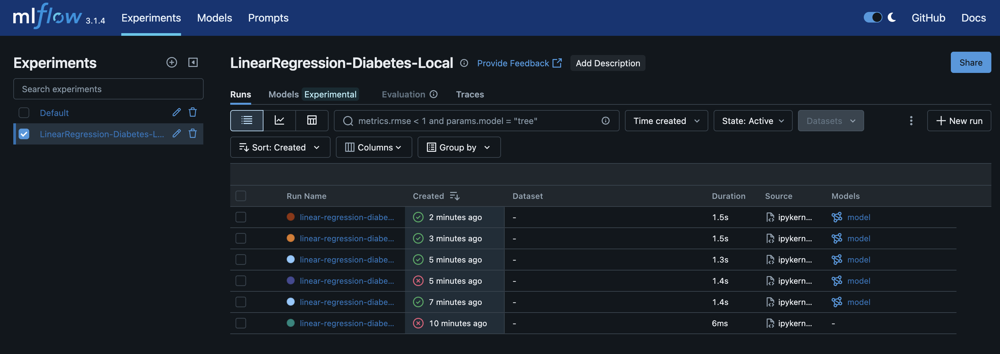

- Added RandomForestRegressor alongside Linear Regression, logging model_type, n_estimators, max_depth; Random Forest achieved higher R² (0.505 vs 0.108).

- Added analyze_predictions() to report ranges, mean error, and std; logged pred_mean, pred_std, residual_std to MLflow (6 metrics total).

- Added print_dataset_info() to display train/test sizes, feature count, and target range.

# MLFlow Screenshot

